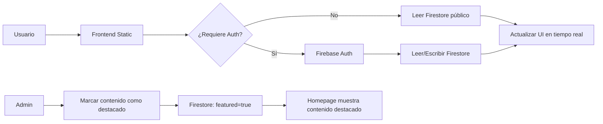

# Te-incluye 🌟

> Plataforma web accesible para la inclusión de personas con discapacidad en Colombia

📧 **Contacto:** [teincluye222@gmail.com](mailto:teincluye222@gmail.com)

[](LICENSE)
[](https://firebase.google.com)
[](docs/accesibilidad.md)

---

## 📋 Tabla de Contenidos

- [✨ ¿Qué es Te-incluye?](#-qué-es-te-incluye)
- [🚀 Características](#-características)
- [🗂️ Estructura del Sitio](#️-estructura-del-sitio)
- [🏗️ Arquitectura Técnica](#️-arquitectura-técnica)
- [🔧 Configuración Firebase](#-configuración-firebase)
- [🛠️ Desarrollo](#️-desarrollo)
- [♿ Accesibilidad](#-accesibilidad)
- [🚀 Deployment](#-deployment)
- [🤝 Contribuir](#-contribuir)
- [📄 Licencia](#-licencia)
- [🔄 Actualizaciones Recientes](#-actualizaciones-recientes)

---

## ✨ ¿Qué es Te-incluye?

**Te-incluye** es una plataforma digital diseñada con enfoque en **accesibilidad universal** e **inclusión social**. Su propósito es:

- 🎯 Visibilizar proyectos y recursos para personas con discapacidad
- 🤝 Conectar a beneficiarios, voluntarios y organizaciones aliadas
- 📚 Proporcionar información verificada y accesible sobre derechos y servicios
- 🎨 Mostrar historias inspiradoras a través de galería multimedia
- ⚙️ Ofrecer un panel administrativo sencillo para gestión de contenido

> **Demo en vivo**: [https://jhormancastella.github.io/incluyeme/](https://jhormancastella.github.io/incluyeme/)

---

## 🔄 Actualizaciones Recientes

### Mayo 2026
- ✅ Email de contacto `teincluye222@gmail.com` agregado en todos los footers
- ✅ Bandera del orgullo de la discapacidad agregada en `historia.html` y galería
- ✅ Videos de YouTube actualizados en seed data con contenido inclusivo:
  - Inclusión laboral
  - Tecnología asistiva
  - Deporte adaptado
- ✅ Optimizaciones de responsive móvil para pantallas <480px
- ✅ Mejoras en accesibilidad de componentes en dispositivos táctiles

---

## 🚀 Características Principales

### 🌐 Sitio Público
- ✅ Diseño responsive mobile-first con CSS moderno
- ✅ Navegación completa por teclado (WCAG 2.1 AA)
- ✅ Soporte para lectores de pantalla (ARIA labels, roles semánticos)
- ✅ Modo claro/oscuro con persistencia y detección de sistema
- ✅ Galería de imágenes con lightbox accesible
- ✅ Reproducción de videos (YouTube, Vimeo, Facebook) con subtítulos
- ✅ Formulario de registro con validación accesible
- ✅ Estadísticas animadas con contador accesible
- ✅ Páginas dedicadas por sección: Galería, Videos, Proyectos, Recursos, Historia

### ⚙️ Panel Administrativo
- 🔐 Autenticación segura con Firebase Auth
- 📊 Dashboard con métricas en tiempo real
- ⭐ **Gestión de destacados**: Marca contenido para mostrar en homepage
- 🖼️ CRUD completo para galería de imágenes
- 🎬 Gestión de videos embebidos con miniaturas
- 🏗️ Administración de proyectos con categorías y ubicación
- 👥 Visualización y exportación de registros en JSON
- ⚙️ Configuración básica del sitio (modo mantenimiento, mensajes)

### 🔧 Técnico
- 🗄️ Backend: Firebase (Firestore, Auth, Storage)
- 🎨 Frontend: HTML5 semántico, CSS3 con Variables, JavaScript ES6 Modules
- ♿ Accesibilidad: WCAG 2.1 AA compliant, pruebas con axe-core
- 📱 PWA-ready (Service Worker opcional)
- 🔒 Seguridad: XSS prevention, validación de inputs, reglas de Firestore

---

## 🗂️ Estructura del Sitio

```
Te-incluye/
├── 📄 index.html              # Homepage con contenido destacado
├── 📄 galeria.html            # Galería completa de imágenes
├── 📄 videos.html             # Colección de videos inspiradores
├── 📄 proyectos.html          # Listado de proyectos municipales
├── 📄 recursos.html           # Directorio de recursos y servicios
├── 📄 historia.html           # Historia de discapacidad en Colombia
├── 📄 admin.html              # Panel de administración
├── 📄 README.md               # Este archivo
│
├── 📁 assets/
│   ├── 📁 css/
│   │   ├── variables.css      # Design tokens (colores, spacing, typography)
│   │   ├── reset.css          # Base reset accesible
│   │   ├── layout.css         # Header, main, footer, grids responsive
│   │   ├── components.css     # Botones, cards, modales, badges, alerts
│   │   ├── forms.css          # Inputs, labels, validación accesible
│   │   └── style.css          # Agregador principal (importa todos los módulos)
│   │
│   ├── 📁 js/
│   │   ├── firebase-config.js # Inicialización Firebase SDK
│   │   ├── db.js              # Abstracción Firestore CRUD
│   │   ├── app.js             # Orquestador principal (público)
│   │   ├── admin.js           # Lógica del panel administrativo
│   │   ├── theme.js           # Toggle modo claro/oscuro
│   │   ├── navigation.js      # Menú móvil, tabs, skip links
│   │   ├── registry.js        # Formulario de registro
│   │   ├── utils.js           # Helpers y utilidades
│   │   └── 📁 ui/
│   │       ├── gallery.js     # Galería de imágenes + lightbox accesible
│   │       ├── videos.js      # Embed de videos con lazy loading
│   │       └── stats.js       # Contadores animados accesibles
│   │
│   ├── 📁 images/             # Recursos gráficos estáticos
│   │   ├── logo.png
│   │   ├── placeholder.jpg
│   │   └── ...
│   │
│   └── 📁 videos/             # Videos locales (opcional)
│
├── 📁 docs/
│   ├── arquitectura.md        # Documentación técnica detallada
│   └── accesibilidad.md       # Checklist WCAG y pruebas
│
├── 📁 _legacy/                # Archivos de versiones anteriores (backup)
├── 📁 .git/                   # Repositorio Git
├── 📁 .vscode/                # Configuración de VS Code
├── 📄 .gitignore              # Archivos ignorados por Git
└── 📄 firebase.json           # Configuración Firebase CLI (opcional)
```

---

## 🏗️ Arquitectura Técnica

```
┌─────────────────────────────────────┐
│  Frontend (Static Hosting)          │
│  • GitHub Pages / Netlify / Vercel  │
├─────────────────────────────────────┤
│  JavaScript ES6 Modules             │
│  • app.js        → Orquestador      │
│  • firebase-config.js → SDK Init    │
│  • db.js         → Firestore CRUD   │
│  • admin.js      → Panel Admin      │
│  • ui/           → Componentes UI   │
├─────────────────────────────────────┤
│  CSS Modular con Variables          │
│  • variables.css → Design Tokens    │
│  • reset.css     → Base accesible   │
│  • layout.css    → Estructura       │
│  • components.css → UI Reutilizable │
│  • forms.css     → Formularios      │
│  • style.css     → Aggregator       │
├─────────────────────────────────────┤
│  Firebase Backend                   │
│  • Firestore     → Base de datos    │
│  • Auth          → Autenticación    │
│  • Storage       → Archivos         │
└─────────────────────────────────────┘
```

### Flujo de Datos


---

## 🔧 Configuración Firebase

### 1. Crear proyecto en Firebase Console
1. Ve a [console.firebase.google.com](https://console.firebase.google.com)
2. Crea un nuevo proyecto: `te-incluye`
3. Habilita los siguientes productos:
   - ✅ **Authentication** (Email/Password)
   - ✅ **Cloud Firestore** (modo prueba inicial)
   - ✅ **Storage** (para imágenes)

### 2. Configurar reglas de Firestore
```javascript
// firestore.rules
rules_version = '2';
service cloud.firestore {
  match /databases/{database}/documents {
    
    // Colecciones públicas (lectura para todos)
    match /gallery/{id} {
      allow read: if true;
      allow write: if request.auth != null;
    }
    match /videos/{id} {
      allow read: if true;
      allow write: if request.auth != null;
    }
    match /projects/{id} {
      allow read: if true;
      allow write: if request.auth != null;
    }
    match /stats/{id} {
      allow read: if true;
      allow write: if request.auth != null;
    }
    match /config/{id} {
      allow read: if true;
      allow write: if request.auth != null;
    }
    
    // Colecciones protegidas
    match /registry/{id} {
      allow read, write: if request.auth != null;
    }
  }
}
```

### 3. Configurar Storage Rules
```javascript
// storage.rules
rules_version = '2';
service firebase.storage {
  match /b/{bucket}/o {
    match /{allPaths=**} {
      allow read: if true;
      allow write: if request.auth != null 
        && request.resource.size < 5 * 1024 * 1024
        && request.resource.contentType.matches('image/.*');
    }
  }
}
```

### 4. Crear usuario administrador
En Firebase Console → Authentication → Users:
```
Email: admin@incluyeme.com
Contraseña: [generar segura y guardar en gestor de contraseñas]
```

### 5. Actualizar configuración en el código
El archivo `assets/js/firebase-config.js` ya incluye la configuración del proyecto `te-incluye`. Si usas otro proyecto, actualiza el objeto `firebaseConfig`.

---

## 🛠️ Desarrollo

### Requisitos
- Navegador moderno con soporte ES6 Modules:
  - Chrome 87+ ✅
  - Firefox 78+ ✅
  - Safari 14+ ✅
  - Edge 87+ ✅

### Ejecutar localmente
```bash
# 1. Clonar repositorio
git clone https://github.com/jhormancastella/incluyeme.git
cd incluyeme

# 2. Abrir en navegador (sin servidor requerido)
# Opción A: Doble-click en index.html
# Opción B: Usar extensión "Live Server" de VS Code
# Opción C: Servidor simple con Python
python -m http.server 8000
# Luego visitar: http://localhost:8000

# 3. Acceder al admin (credenciales de Firebase)
# Email: admin@incluyeme.com
# Contraseña: [la que configuraste]
```

### Estructura de commits recomendada
```bash
# Features
git commit -m "feat(gallery): agregar filtro por categoría accesible"

# Fixes
git commit -m "fix(a11y): corregir focus trap en lightbox"

# Docs
git commit -m "docs: actualizar README con configuración Firebase"

# Refactor
git commit -m "refactor(css): consolidar módulos en style.css aggregator"

# Style
git commit -m "style: actualizar branding a Te-incluye"
```

---

## ♿ Accesibilidad

### Cumplimiento WCAG 2.1 Nivel AA

| Criterio | Estado | Implementación |
|----------|--------|---------------|
| **1.1.1** Contenido no textual | ✅ | `alt` en imágenes, `aria-label` en iconos |
| **1.3.1** Info y relaciones | ✅ | HTML semántico, ARIA roles, labels asociados |
| **1.4.3** Contraste (mínimo) | ✅ | Ratio 4.5:1 verificado en variables CSS |
| **2.1.1** Teclado | ✅ | Navegación completa sin mouse |
| **2.4.3** Orden de foco | ✅ | Orden lógico en DOM, focus management en modales |
| **2.4.7** Foco visible | ✅ | Outline personalizado con `:focus-visible` |
| **3.3.1** Identificación de errores | ✅ | Mensajes de error asociados con `aria-describedby` |
| **4.1.2** Nombre, rol, valor | ✅ | ARIA attributes en componentes dinámicos |

### Pruebas de accesibilidad recomendadas

```bash
# 1. Axe Core (automated)
# Instalar extensión: https://chrome.google.com/webstore/detail/axe-devtools

# 2. Lighthouse (Chrome DevTools)
# Pestaña "Lighthouse" → Seleccionar "Accessibility" → Generate report

# 3. Navegación manual con teclado
# Tab, Shift+Tab, Enter, Escape, flechas en todos los componentes

# 4. Lector de pantalla
# NVDA (Windows) o VoiceOver (macOS) para pruebas manuales
```

### Checklist rápido de desarrollo
```javascript
// ✅ Antes de hacer commit:
// [ ] ¿Todos los elementos interactivos son focusable?
// [ ] ¿Los iconos decorativos tienen aria-hidden="true"?
// [ ] ¿Los iconos funcionales tienen texto alternativo?
// [ ] ¿Los formularios tienen labels asociados?
// [ ] ¿Los mensajes de error están vinculados con aria-describedby?
// [ ] ¿El contraste de texto cumple 4.5:1?
// [ ] ¿Se puede navegar solo con teclado?
// [ ] ¿Los modales tienen focus trap y cierre con Escape?
```

---

## 🚀 Deployment

### Opción A: GitHub Pages (Recomendada para inicio)
```bash
# 1. En GitHub: Settings → Pages → Source: "main branch / root"
# 2. El sitio se publicará en: https://tu-usuario.github.io/incluyeme/

# 3. Actualizar firebase-config.js con CORS habilitado:
// En Firebase Console → Authentication → Settings → Authorized domains
// Agregar: tu-usuario.github.io
```

### Opción B: Netlify (Con deploy continuo)
```bash
# 1. Conectar repositorio en https://app.netlify.com/
# 2. Configuración automática detecta sitio estático
# 3. Variables de entorno (si se necesitan):
#    - FIREBASE_API_KEY, etc. (aunque están en el código frontend)

# 4. Redirects opcionales (netlify.toml):
[[redirects]]
  from = "/*"
  to = "/index.html"
  status = 200
```

### Opción C: Firebase Hosting (Integración nativa)
```bash
# 1. Instalar Firebase CLI
npm install -g firebase-tools

# 2. Login y inicializar
firebase login
firebase init hosting

# 3. Configurar firebase.json:
{
  "hosting": {
    "public": ".",
    "ignore": ["firebase.json", "**/.*", "**/node_modules/**"],
    "rewrites": [
      { "source": "**", "destination": "/index.html" }
    ]
  }
}

# 4. Deploy
firebase deploy
```

### Post-deployment checklist
- [ ] Verificar que Firebase Auth domains incluyen la URL de producción
- [ ] Probar formulario de registro en producción
- [ ] Verificar que las imágenes de Storage cargan correctamente
- [ ] Ejecutar Lighthouse en URL de producción
- [ ] Configurar analytics (opcional: Plausible, Fathom - respetuoso con privacidad)

---

## 🤝 Contribuir

¡Las contribuciones son bienvenidas! Sigue estos pasos:

1. **Fork** el repositorio
2. Crea una rama para tu feature: `git checkout -b feature/nueva-funcionalidad`
3. Commit tus cambios: `git commit -m 'feat: descripción clara'`
4. Push a la rama: `git push origin feature/nueva-funcionalidad`
5. Abre un **Pull Request**

### Convenciones de código
- **JavaScript**: ESLint config en `.vscode/settings.json`, usar `const/let`, arrow functions
- **CSS**: Variables CSS, mobile-first, BEM naming opcional
- **HTML**: Semántico, ARIA cuando sea necesario, atributos de accesibilidad
- **Commits**: [Conventional Commits](https://www.conventionalcommits.org/)

### Áreas donde se necesita ayuda 🙏
- [ ] Tests automatizados (Jest + Testing Library)
- [ ] Internacionalización (i18n) para múltiples idiomas
- [ ] PWA: Service Worker para soporte offline
- [ ] Integración con APIs gubernamentales de inclusión
- [ ] Mejoras de performance (lazy loading avanzado, code splitting)

---

## 📄 Licencia

Este proyecto está bajo la **Licencia MIT** - ver el archivo [LICENSE](LICENSE) para detalles.

```
MIT License

Copyright (c) 2026 Jhorman Castellanos

Permission is hereby granted, free of charge, to any person obtaining a copy
of this software and associated documentation files (the "Software"), to deal
in the Software without restriction, including without limitation the rights
to use, copy, modify, merge, publish, distribute, sublicense, and/or sell
copies of the Software, and to permit persons to whom the Software is
furnished to do so, subject to the following conditions:

The above copyright notice and this permission notice shall be included in all
copies or substantial portions of the Software.

THE SOFTWARE IS PROVIDED "AS IS", WITHOUT WARRANTY OF ANY KIND, EXPRESS OR
IMPLIED, INCLUDING BUT NOT LIMITED TO THE WARRANTIES OF MERCHANTABILITY,
FITNESS FOR A PARTICULAR PURPOSE AND NONINFRINGEMENT. IN NO EVENT SHALL THE
AUTHORS OR COPYRIGHT HOLDERS BE LIABLE FOR ANY CLAIM, DAMAGES OR OTHER
LIABILITY, WHETHER IN AN ACTION OF CONTRACT, TORT OR OTHERWISE, ARISING FROM,
OUT OF OR IN CONNECTION WITH THE SOFTWARE OR THE USE OR OTHER DEALINGS IN THE
SOFTWARE.
```

---

> 💡 **Nota**: Este proyecto fue creado con ❤️ para promover la inclusión digital. 
> Si encuentras problemas de accesibilidad, por favor [abre un issue](https://github.com/jhormancastella/incluyeme/issues).

**Autor**: Jhorman Castellanos  
**Contacto**: [GitHub](https://github.com/jhormancastella)  
**Última actualización**: Mayo 2026
